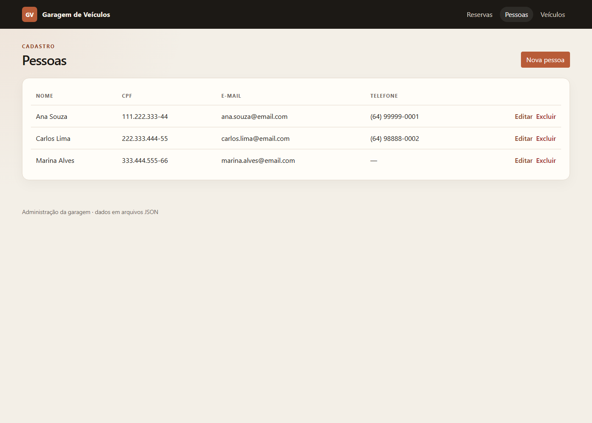
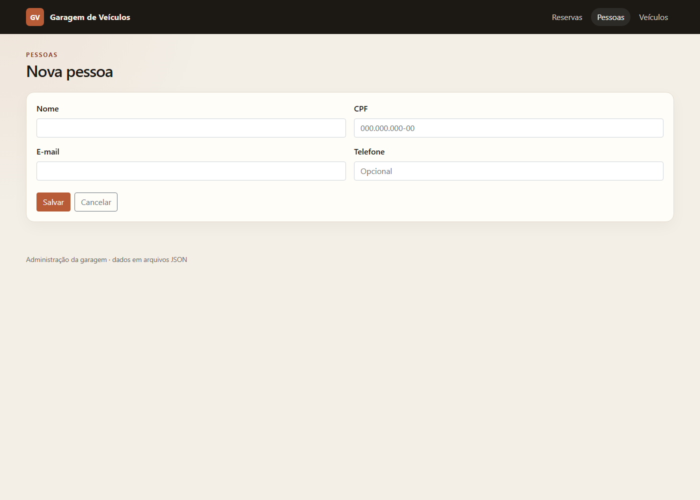
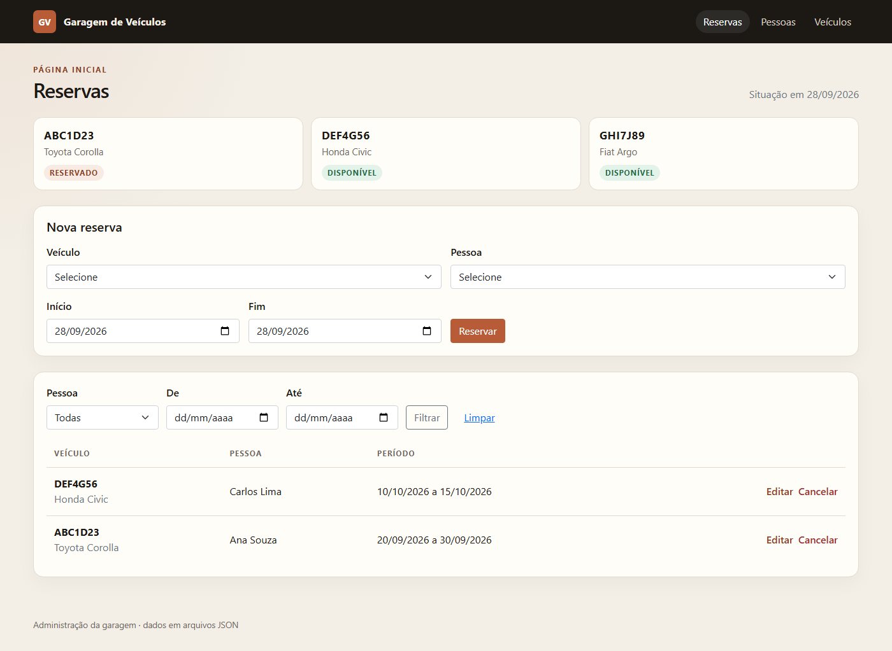
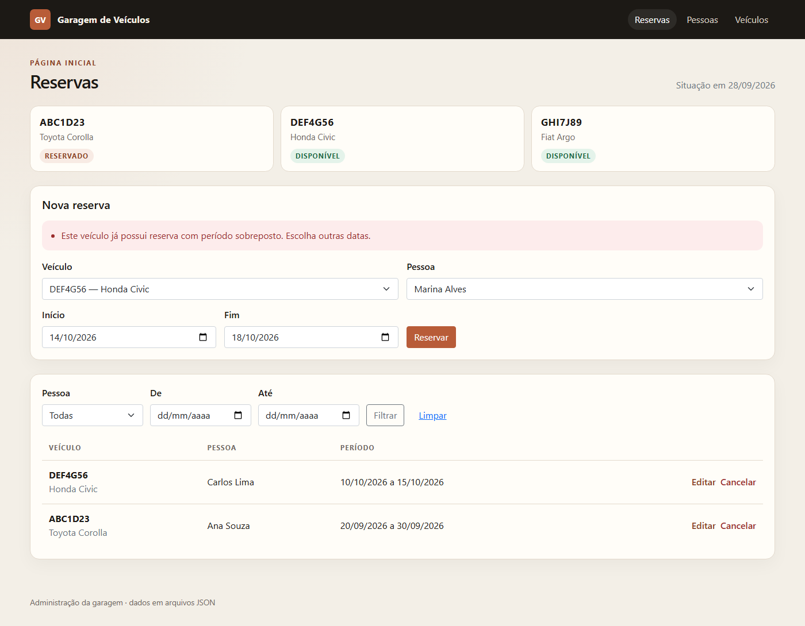

# Garagem de Veículos

Sistema de administração de garagem: cadastro de pessoas, cadastro de veículos e reservas por período.

## Integrantes

- Yasmim Tizo

## Linguagem e framework

- C# / ASP.NET Core MVC
- .NET 8
- Persistência em arquivos JSON (`Data/pessoas.json`, `Data/veiculos.json`, `Data/reservas.json`)

## Como executar

Na pasta do projeto:

```bash
dotnet run --launch-profile http
```

Abra [http://localhost:5084](http://localhost:5084). A página inicial é Reservas.

## Arquitetura

O fluxo dos dados é View → Controller → interface do repositório → repositório → arquivo JSON.

O Controller recebe a interface pelo construtor. Quem entrega a classe concreta é o container de injeção de dependência, em `Program.cs`:

```csharp
builder.Services.AddScoped<IPessoaRepository, PessoaRepository>();
builder.Services.AddScoped<IVeiculoRepository, VeiculoRepository>();
builder.Services.AddScoped<IReservaRepository, ReservaRepository>();
```

A regra de período sobreposto fica fora do Controller: `ReservaRepository.ExisteConflito` consulta as reservas e `ReservaService.Validar` reúne as regras. O Controller só chama o serviço e mostra a mensagem.

Pessoa ou veículo com reserva em andamento ou futura não pode ser excluído. A listagem de reservas pode ser filtrada por pessoa e por período.

Um veículo aparece como Reservado quando existe reserva que cobre a data de hoje. O status é calculado; não fica gravado no veículo.

## Prints

### Entrega 1





### Entrega 2





## Ferramentas de IA

- Cursor, com o modelo Grok, para montar a estrutura MVC, os repositórios JSON e as telas.
